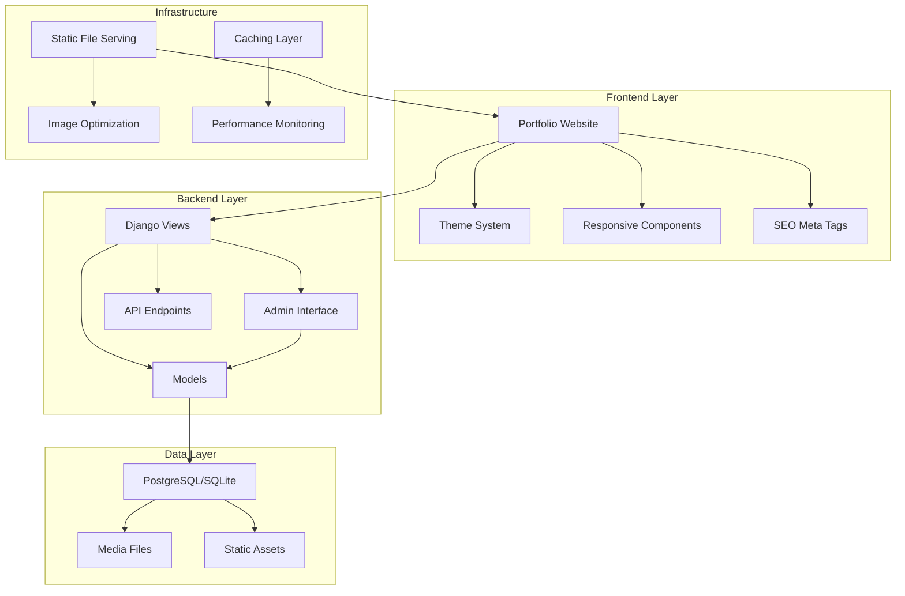
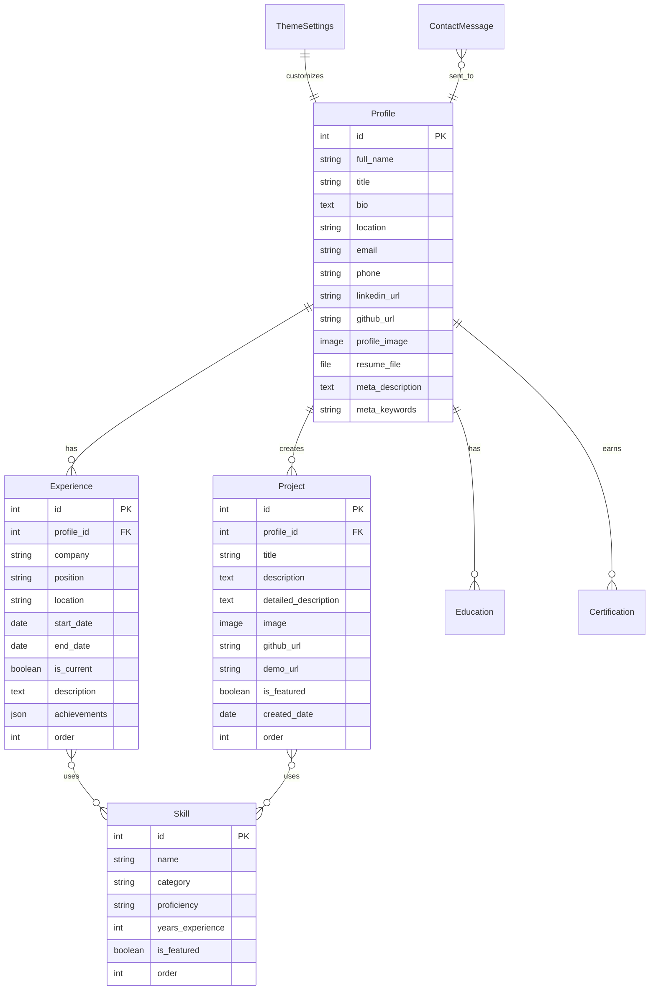

# Design Document

## Overview

The AI Engineer Portfolio is a modern, responsive web application built with Django that serves as both a professional showcase and a content management system. The architecture follows Django's MVT (Model-View-Template) pattern with a clean separation between the public portfolio frontend and the admin dashboard backend. The system emphasizes performance, SEO optimization, and user experience while providing comprehensive content management capabilities.

## Architecture

### System Architecture



### Technology Stack

**Backend:**
- Django 4.2+ (LTS) - Web framework
- Django REST Framework - API endpoints for dynamic content
- Pillow - Image processing and optimization
- Django-environ - Environment configuration
- Whitenoise - Static file serving

**Frontend:**
- HTML5 with semantic markup
- Tailwind CSS for modern, utility-first styling
- CSS3 with CSS Grid and Flexbox (via Tailwind)
- Vanilla JavaScript (ES6+) for interactions
- CSS Custom Properties for theming (integrated with Tailwind)
- Intersection Observer API for animations
- Headless UI components for interactive elements

**Database:**
- SQLite (both development and production)
- Django ORM for data management

**Performance & SEO:**
- Django-compressor for asset optimization
- Tailwind CSS JIT compilation for minimal CSS bundle
- Django-meta for SEO meta tags
- Lazy loading for images
- Service Worker for caching (optional)

## Components and Interfaces

### Core Models

#### Profile Model
```python
class Profile(models.Model):
    # Personal Information
    full_name = models.CharField(max_length=100)
    title = models.CharField(max_length=200)
    bio = models.TextField()
    location = models.CharField(max_length=100)
    email = models.EmailField()
    phone = models.CharField(max_length=20, blank=True)
    
    # Social Links
    linkedin_url = models.URLField(blank=True)
    github_url = models.URLField(blank=True)
    twitter_url = models.URLField(blank=True)
    
    # Media
    profile_image = models.ImageField(upload_to='profile/')
    resume_file = models.FileField(upload_to='documents/')
    
    # SEO
    meta_description = models.TextField(max_length=160)
    meta_keywords = models.CharField(max_length=255)
```

#### Experience Model
```python
class Experience(models.Model):
    company = models.CharField(max_length=100)
    position = models.CharField(max_length=100)
    location = models.CharField(max_length=100)
    start_date = models.DateField()
    end_date = models.DateField(null=True, blank=True)
    is_current = models.BooleanField(default=False)
    description = models.TextField()
    achievements = models.JSONField(default=list)  # List of achievements
    technologies = models.ManyToManyField('Skill', blank=True)
    order = models.PositiveIntegerField(default=0)
```

#### Skill Model
```python
class Skill(models.Model):
    CATEGORY_CHOICES = [
        ('programming', 'Programming Languages'),
        ('ai_ml', 'AI/ML Frameworks'),
        ('backend', 'Backend/Data'),
        ('tools', 'Engineering Tools'),
        ('cloud', 'Cloud/MLOps'),
    ]
    
    PROFICIENCY_CHOICES = [
        ('beginner', 'Beginner'),
        ('intermediate', 'Intermediate'),
        ('advanced', 'Advanced'),
        ('expert', 'Expert'),
    ]
    
    name = models.CharField(max_length=50)
    category = models.CharField(max_length=20, choices=CATEGORY_CHOICES)
    proficiency = models.CharField(max_length=20, choices=PROFICIENCY_CHOICES)
    years_experience = models.PositiveIntegerField(default=0)
    is_featured = models.BooleanField(default=False)
    order = models.PositiveIntegerField(default=0)
```

#### Project Model
```python
class Project(models.Model):
    title = models.CharField(max_length=100)
    description = models.TextField()
    detailed_description = models.TextField(blank=True)
    image = models.ImageField(upload_to='projects/')
    technologies = models.ManyToManyField('Skill')
    github_url = models.URLField(blank=True)
    demo_url = models.URLField(blank=True)
    is_featured = models.BooleanField(default=False)
    created_date = models.DateField()
    order = models.PositiveIntegerField(default=0)
```

### Frontend Components

#### Theme System
- Tailwind CSS dark mode with class-based strategy
- CSS Custom Properties integration for dynamic theming
- JavaScript theme switcher with localStorage persistence
- System preference detection with `prefers-color-scheme`
- Smooth theme transitions using Tailwind transition utilities

#### Responsive Layout
- Tailwind CSS mobile-first responsive design
- Built-in responsive utilities (sm, md, lg, xl, 2xl)
- CSS Grid and Flexbox through Tailwind utilities
- Custom breakpoints: sm (640px), md (768px), lg (1024px), xl (1280px), 2xl (1536px)

#### Navigation System
- Sticky header with smooth scroll navigation
- Mobile hamburger menu
- Active section highlighting
- Smooth scroll behavior

### Admin Interface Customization

#### Custom Admin Classes
```python
@admin.register(Profile)
class ProfileAdmin(admin.ModelAdmin):
    fieldsets = [
        ('Personal Information', {
            'fields': ['full_name', 'title', 'bio', 'location']
        }),
        ('Contact Information', {
            'fields': ['email', 'phone']
        }),
        ('Social Media', {
            'fields': ['linkedin_url', 'github_url', 'twitter_url']
        }),
        ('Media Files', {
            'fields': ['profile_image', 'resume_file']
        }),
        ('SEO Settings', {
            'fields': ['meta_description', 'meta_keywords']
        }),
    ]
```

#### Theme Customization Model
```python
class ThemeSettings(models.Model):
    # Color Scheme
    primary_color = models.CharField(max_length=7, default='#3B82F6')
    secondary_color = models.CharField(max_length=7, default='#1E40AF')
    accent_color = models.CharField(max_length=7, default='#F59E0B')
    
    # Typography
    font_family = models.CharField(max_length=100, default='Inter, sans-serif')
    heading_font = models.CharField(max_length=100, default='Inter, sans-serif')
    
    # Layout
    max_width = models.PositiveIntegerField(default=1200)
    section_spacing = models.PositiveIntegerField(default=80)
    
    # Custom CSS
    custom_css = models.TextField(blank=True)
```

## Data Models

### Database Schema



### Content Management Strategy

#### Section Management
```python
class PortfolioSection(models.Model):
    SECTION_CHOICES = [
        ('hero', 'Hero Section'),
        ('about', 'About Section'),
        ('experience', 'Experience Section'),
        ('skills', 'Skills Section'),
        ('projects', 'Projects Section'),
        ('education', 'Education Section'),
        ('contact', 'Contact Section'),
    ]
    
    name = models.CharField(max_length=20, choices=SECTION_CHOICES)
    is_enabled = models.BooleanField(default=True)
    order = models.PositiveIntegerField(default=0)
    custom_title = models.CharField(max_length=100, blank=True)
    custom_description = models.TextField(blank=True)
```

## Error Handling

### Frontend Error Handling
- Graceful degradation for JavaScript failures
- Fallback content for missing images
- Form validation with user-friendly messages
- Loading states for dynamic content

### Backend Error Handling
- Custom 404 and 500 error pages
- Comprehensive logging with Django's logging framework
- Input validation and sanitization
- File upload security and size limits

### Performance Monitoring
```python
# Custom middleware for performance tracking
class PerformanceMiddleware:
    def __init__(self, get_response):
        self.get_response = get_response
    
    def __call__(self, request):
        start_time = time.time()
        response = self.get_response(request)
        duration = time.time() - start_time
        
        # Log slow requests
        if duration > 1.0:
            logger.warning(f"Slow request: {request.path} took {duration:.2f}s")
        
        return response
```

## Testing Strategy

### Unit Testing
- Model validation and business logic
- Form processing and validation
- Custom template tags and filters
- Admin interface customizations

### Integration Testing
- View functionality and response codes
- Template rendering and context data
- File upload and media handling
- Theme switching functionality

### Frontend Testing
- JavaScript functionality (theme switching, form validation)
- Responsive design across devices
- Cross-browser compatibility
- Accessibility compliance (WCAG 2.1)

### Performance Testing
- Page load speed optimization
- Image optimization and lazy loading
- Database query optimization
- Caching strategy validation

### SEO Testing
- Meta tag generation
- Structured data validation
- Core Web Vitals monitoring
- Mobile-friendliness testing

## Security Considerations

### Django Security Best Practices
- CSRF protection enabled
- Secure cookie settings
- SQL injection prevention through ORM
- XSS protection with template escaping
- File upload validation and restrictions

### Admin Security
- Strong authentication requirements
- Session timeout configuration
- Admin URL obfuscation
- Rate limiting for login attempts

### Content Security
- Image file type validation
- File size limitations
- Secure file storage configuration
- Input sanitization for rich text content

## Deployment Architecture

### Production Setup
The application will be designed for flexible deployment with comprehensive documentation provided in a README file covering:
- WSGI server configuration (Gunicorn recommended)
- Web server setup (Nginx reverse proxy)
- Static file serving configuration
- SQLite database optimization and backup strategies
- Environment variable configuration
- SSL/TLS certificate setup
- Performance tuning guidelines

### Performance Optimization
- Database query optimization with select_related/prefetch_related
- Template fragment caching
- Static file compression and minification
- Image optimization pipeline
- Browser caching headers
- SQLite optimization with WAL mode and proper indexing